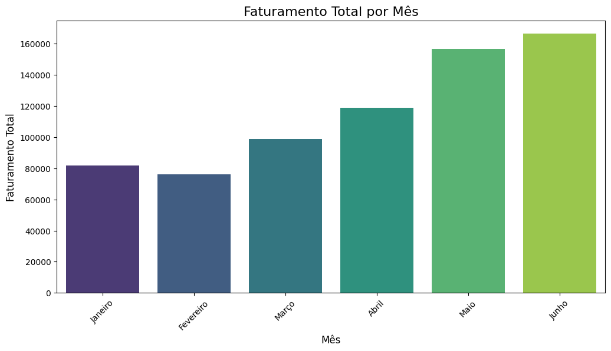

[Leia em Português](README.pt.md)

---

# Coffee Shop Sales Analysis

This project is an exploratory data analysis (EDA) of sales data from a coffee shop, covering the period from January to June 2023. The goal is to extract actionable business insights by analyzing revenue, products, and consumer behavior patterns.

## 🎯 Objective

The analysis aims to answer three key business questions:
1.  Which are the months with the highest and lowest revenue?
2.  What are the best-selling product categories?
3.  On which days of the week does the coffee shop sell the most?

## 🛠️ Tools Used
* **Python** as the programming language
* **Pandas** for data cleaning and manipulation
* **Matplotlib** & **Seaborn** for data visualization
* **Jupyter Notebook / Google Colab** as the development environment

## 📊 Data Source
The data used in this project is public and was sourced from Kaggle. You can access it through the following link:
* **Dataset:** [Coffee Sales on Kaggle](https://www.kaggle.com/datasets/ahmedabbas757/coffee-sales)

## 🚀 How to Run the Project
1.  Clone or download this repository.
2.  Download the dataset from the [Kaggle link](https://www.kaggle.com/datasets/ahmedabbas757/coffee-sales) provided above.
3.  Place the `.xlsx` file in the same folder as the project.
4.  Open the `analise_de_vendas_cafeteria.ipynb` notebook to view and run the complete analysis.

## 📈 Analysis and Insights

### 1. Total Revenue per Month

**Insight:** Revenue grew consistently from January to May, which was the peak month of the semester. June saw a slight decrease, suggesting an opportunity to investigate and perhaps launch marketing campaigns to sustain growth in the second half of the year.

### 2. Best-Selling Product Categories

**Insight:** "Café" (Coffee) is the absolute leading category, confirming the business's core product is performing well. "Chá" (Tea) and "Padaria" (Bakery) are the next most popular, indicating great potential for creating bundled deals (combos) to increase the average ticket value per customer.

### 3. Sales by Day of the Week

**Insight:** The coffee shop has a strong and steady flow of customers throughout the week, with a peak on Mondays. Saturdays show a slight dip, presenting an opportunity for specific promotions (like a "Saturday Brunch") to boost customer traffic.
